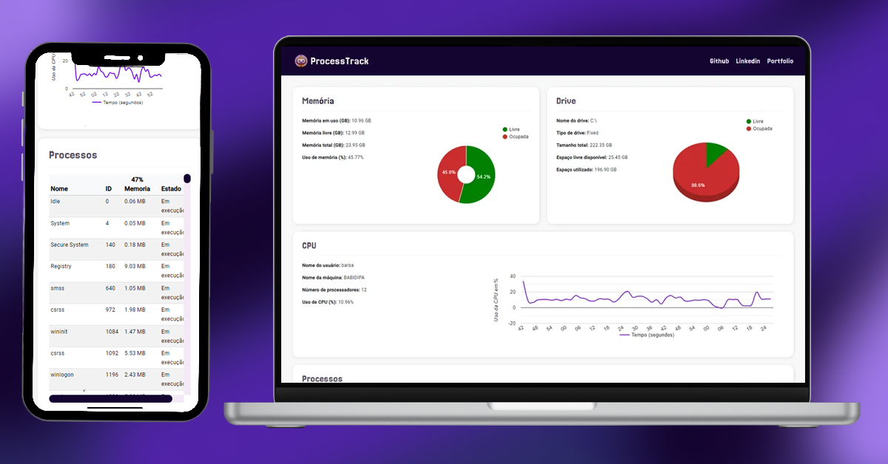
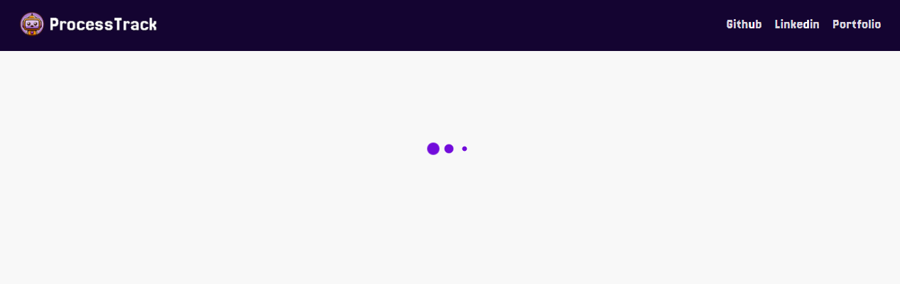
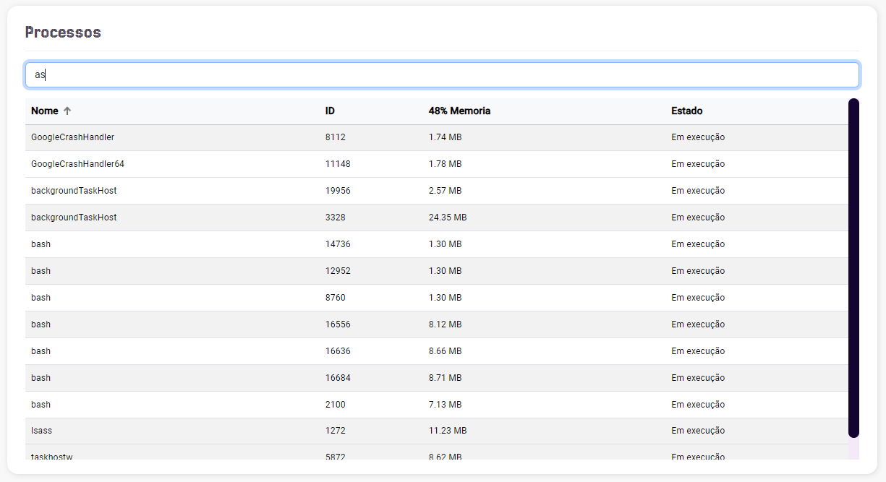
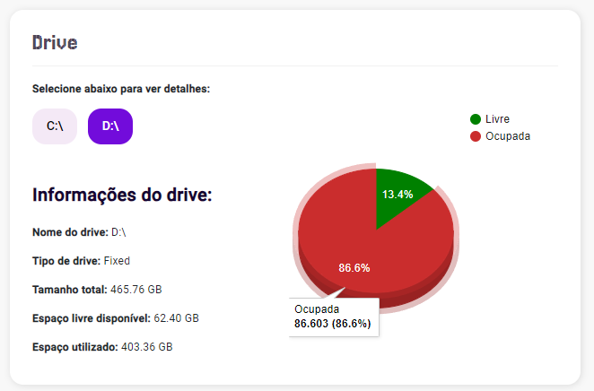
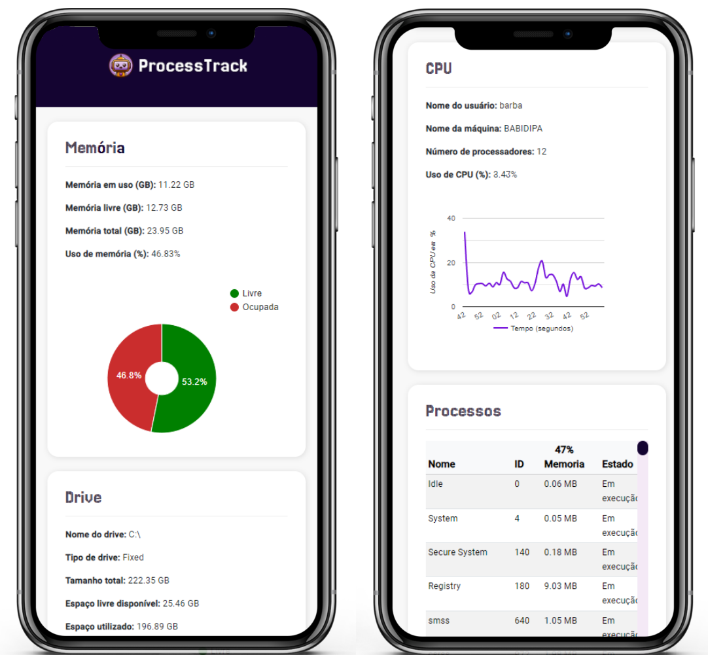

# Monitor de Processos com Angular 17 e .NET 8

## 🌐 Desafio

Desafio para a seleção da MXM. O Objetivo era criar um monitor de processos do Sistema operacional, listando os processos, os recursos consumidos, com opção de ordenação nas colunas e utilizar gráficos para ilustrar o processamento.




## 🌐 Pré-requisitos para rodar o projeto

  - .NET Core SDK 8
  - Node.js e npm
  - Angular 17 / ```npm install -g @angular/cli@17```


### Clonando o repositorio

```bash
> git clone https://github.com/barbaradamasdev/DesafioMXM.git
```
### Executando o Backend

```bash
# Acesse o diretório do projeto backend:
> cd backend/ProcessosAPI/

# Restaure as dependências:
> dotnet restore

# Inicie o backend com o comando
> dotnet watch run
```

### Executando o Frontend

```bash
# Acesse o diretório do projeto frontend:
> cd frontend/MonitorProcessos

# Instale as dependências do Angular
> npm install --legacy-peer-deps

# Inicie o servidor de desenvolvimento do Angular
> ng serve
```
>💡💡💡**Nota**: Embora não seja recomendado o uso do `--legacy-peer-deps`, é necessário neste caso para forçar a instalação. A versão do Google Charts utilizada é muito antiga para o Angular 17, e esta solução foi adotada porque não gerou conflitos no nível do projeto.

## 👑 Demonstração


#### ✍🏻️ Features adicionais

|  Loading para sinalizar ao usuário o carregamento |  Tabela de processos com ordenação e opção de busca | Armazenamento por drives existentes e detalhamento do gráfico com mouse |  Responsividade |
| --- | --- | --- | --- |


#### ✍🏻️ Recursos e Tecnologias Utilizadas

| Tecnologia                                | Uso                                                                               | Site                                      |
|-------------------------------------------|-----------------------------------------------------------------------------------|-------------------------------------------|
| SignalR                                   | Biblioteca que facilita a adição de funcionalidades em tempo real aos aplicativos web. | [SignalR](https://dotnet.microsoft.com/apps/aspnet/real-time)               |
| Swagger                                   | Ferramenta para documentação de APIs RESTful.                                     | [Swagger](https://swagger.io/)                                           |
| PerformanceCounter                        | Classe para acessar e monitorar o desempenho do sistema, incluindo o uso da CPU.  | [PerformanceCounter](https://docs.microsoft.com/en-us/dotnet/api/system.diagnostics.performancecounter) |
| Management Object Searcher                 | Classe para executar consultas WMI (Instrumentação de Gerenciamento do Windows) e recuperar informações sobre o sistema operacional. | [ManagementObjectSearcher](https://docs.microsoft.com/en-us/dotnet/api/system.management.managementobjectsearcher) |
| Google Charts               | Biblioteca JavaScript para criar gráficos interativos e visualizações de dados na web.                                                                  | [Google Charts](https://developers.google.com/chart) |

## 🛠 Desafios e Soluções Enfrentados

### Utilização do SignalR

- Precisei entender a estrutura e como utilizar o SignalR tanto no backend quanto no frontend. Além disso, dediquei um tempo criando o Swagger para documentação da API antes de compreender completamente a necessidade para o SignalR, desafio que foi rapidamente solucionado e serviu para praticar.

### Gráficos em Tempo Real

- Foi desafiante encontrar uma biblioteca certa que atendesse às necessidades específicas de manter de forma dinâmica o gráfico para refletir as mudanças em tempo real. Procurando por bibliotecas encontrei a do Google que foi a utilizada no projeto. Com essa, tive uma nova dificuldade que foi de ajustar o tamanho e a aparência do gráfico garantindo uma experiência visual agradável e pensando em usabilidade.

### Integração com Versões Antigas do Angular

- Na tentativa do deploy obtive erros na versão do Google Charts que é incompatível com a versão do framework. A solução encontrada foi utilizar a flag `--legacy-peer-deps` durante a instalação, mesmo não sendo recomendado. Essa medida foi necessária para evitar conflitos no projeto e permitir a integração do Google Charts com o Angular 17.

## 🐼 Autora
Bárbara Damasceno | barbaradsa@gmail.com | [Linkedin](https://www.linkedin.com/in/barbaradamascenodev) | [Portfolio](https://barbaradamasceno.vercel.app/)
